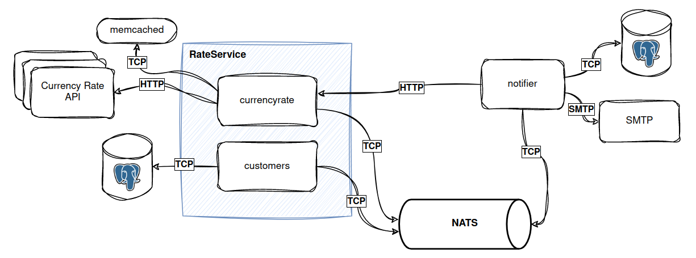
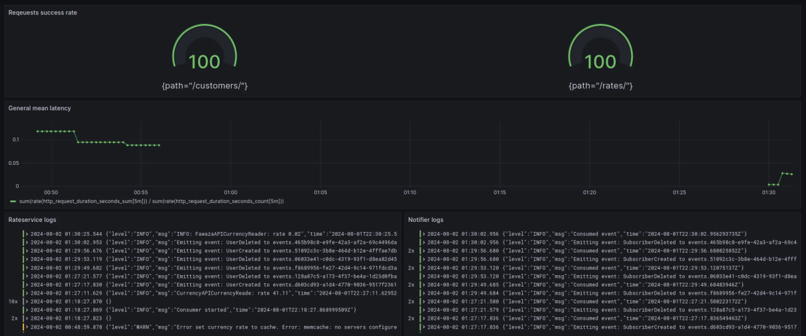

# Currency rate service

This is a simple currency rate service that provides the exchange rate between two currencies.

This project implements some architectural and application patterns. Its main functionality is to find out the exchange rate between two currencies and subscribe to updates of the USD to UAH exchange rate.

The service is divided into 2 logical parts: RateService (the core of the project) and Notifier (a microservice for working with notifications). Architecturally, it looks like a monolith and an auxiliary microservice. 

The monolith is modular and consists of currencyrate and customers modules. The modules are loosely coupled and have only a common start point, so they can be easily moved to separate services.

The structure of the project components is as follows:

## Stack
The following stack was used in the development:
- Go
- Web framework: Fiber
- Database: PostgreSQL
- ORM: GORM
- Event streaming: NATS JetStream
- Cache: Memcached
- Containerization: Docker
- Metrics: Prometheus + VictoriaMetrics
- Logs: Vector + Loki

## Observability
There are many information criteria that we can use to monitor the quality of a system.
They are of two types: business criteria and technical criteria.
The first ones show information for the business that it needs to create/change its next development steps.
The latter show information about the program's operation, its workload, speed, capacity, etc.

The main metrics that are collected are:
- Total requests
- Requests success response rate(calculated by Total requests)
- Mean latency
- Currency rate API success response rate

Below is a part of the grafana dashboard:

